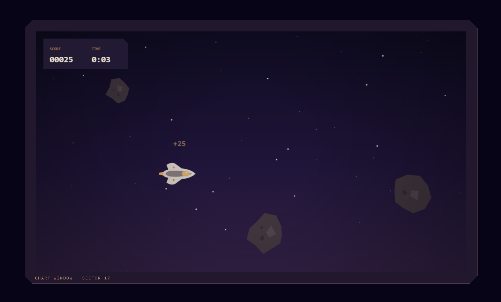

# Astro Drift

A small browser arcade game built with TypeScript and Canvas 2D.

It is also a QA/SDET portfolio project focused on testable game rules, practical automation, and readable architecture.

[Play Astro Drift](https://janmrow.github.io/astro-drift/)



## About

Guide a survey craft vertically through a stream of incoming asteroids. Stay clear of collisions, let hazards pass safely, and keep the run going as the pace increases.

Astro Drift is intentionally small, frontend-only, and focused on one clear arcade loop. Its technical design keeps the gameplay rules readable and directly testable without adding unnecessary infrastructure or abstraction.

## How to Play

| Action | Control |
| --- | --- |
| Start or restart | `Enter` |
| Steer up | `Arrow Up` or `W` |
| Steer down | `Arrow Down` or `S` |
| Brake gameplay speed | `Arrow Left` or `A` |
| Boost gameplay speed | `Arrow Right` or `D` |

Avoid incoming asteroids and pass them safely to increase your score.

## Gameplay Highlights

- Standard and fiery asteroids create distinct hazards to dodge.
- Safely passed asteroids add to the score, while survival time is tracked separately.
- After a brief opening grace period, asteroids become faster and arrive more frequently.
- Asteroid positions are distributed more evenly across the play field to avoid repetitive patterns.
- Clear HUD, pass, collision, and game-state feedback keep the loop easy to read.
- The best score is saved locally in the browser.
- Reduced-motion preferences quiet ambient star movement outside active play.

## Tech Stack

- **Game and build:** TypeScript, Canvas 2D, Vite
- **Testing:** Vitest, `fast-check`, Playwright
- **Quality and automation:** ESLint, GitHub Actions, GitHub Pages

## Getting Started

Use Node.js 22 and npm.

```bash
git clone https://github.com/janmrow/astro-drift.git
cd astro-drift
npm ci
npm run dev
```

To create and preview a production build:

```bash
npm run build
npm run preview
```

## Quality Checks

| Command | Purpose |
| --- | --- |
| `npm run lint` | Lint the repository |
| `npm run typecheck:tests` | Type-check the test suite |
| `npm test` | Run unit and property-based tests |
| `npm run test:e2e` | Build the app and run Playwright browser tests |
| `npm run check` | Run the canonical full local quality gate |

The full gate covers ESLint, TypeScript checks for the tests and application, Vitest, a production build, and Playwright browser tests. The scripts in `package.json` are the executable source of truth.

On a fresh machine, install Playwright's Chromium browser before running browser tests:

```bash
npx playwright install chromium
```

## Architecture

Browser-independent game rules and state updates live separately from Canvas rendering, keyboard input, storage, time, and other browser effects. `src/main.ts` connects that core to the browser shell and animation loop.

This boundary keeps important gameplay behavior directly testable without Canvas pixel assertions. The decision and its trade-offs are recorded in [Architecture Decision: Separate Game Engine from Rendering](docs/ADR-001-separate-engine-from-rendering.md).

## Project Structure

```text
src/game/        game rules and state updates
src/rendering/   Canvas 2D presentation
src/input/       keyboard input
src/storage/     browser persistence
src/main.ts      browser shell and animation loop

tests/unit/      game rules and small boundary modules
tests/e2e/       main browser flows and contracts

docs/            architecture, testing, engineering, and visual decisions
```

## Testing Approach

- Unit tests cover gameplay rules and small boundary modules without requiring a browser.
- Property-based tests use `fast-check` to exercise meaningful invariants across generated inputs.
- Playwright verifies important browser-level flows and stable DOM contracts.
- Manual browser checks cover Canvas presentation and gameplay feel where pixel-level automation would be brittle.

Canvas pixels are not the primary automated contract. Rules are tested below the rendering layer, while browser tests observe stable page behavior. See the [Test Strategy](docs/TEST_STRATEGY.md) for the detailed coverage boundaries and trade-offs.

## Documentation

- [Architecture Decision: Separate Game Engine from Rendering](docs/ADR-001-separate-engine-from-rendering.md) — records the main responsibility boundary between gameplay rules and browser presentation.
- [Engineering Principles](docs/PRINCIPLES.md) — describes the code-quality and design principles used to keep the project small and readable.
- [Test Strategy](docs/TEST_STRATEGY.md) — documents test levels, coverage boundaries, quality gates, and deliberate trade-offs.
- [Visual Style Constraints](docs/VISUAL-STYLE-CONSTRAINTS.md) — records the technical constraints that visual changes must respect.

## CI and Deployment

GitHub Actions runs the canonical `npm run check` gate for pull requests targeting `main`, pushes to `main`, and manual workflow runs. Deployment depends on that verification succeeding: verified `main` pushes and verified manual runs are built and deployed to GitHub Pages.

## License

Astro Drift is available under the [MIT License](LICENSE).
